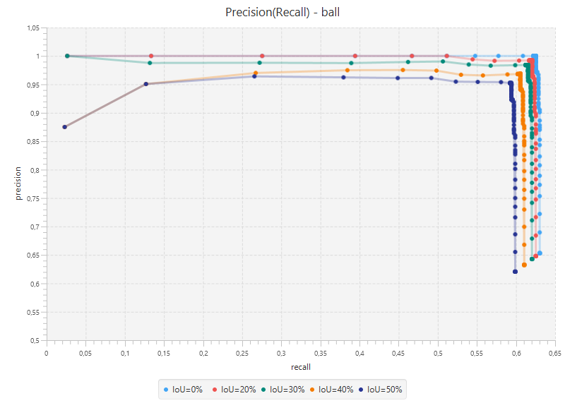

# NETTester
**Written by Matti J. Frind.**
The **NETTester** computes various Average Precisions for the classes “ball” and “foot” and visualizes the precision and recall values in charts.
Open the project in **Netbeans**. When you start the application the software will read the ground truth data and the detections from different files. After the computation of the APs at different IoU thresholds the application will print the results in the output and open a window with the precall-recall charts of the two classes. In the (exported) <strong>Javadoc</strong> you get more information about the structure of the software.
## Settings
At the top of the main class (NETTester.java) you can change some settings.
* **annotationVersion**: changes the way the ground truth data will be interpreted. The detections file *train2_detections.txt* needs the annotationVersion 2. *train3_detections.txt* needs annotationVersion 3.
* **TEST_FILE**: The test file contains the ground truth data and should be *large_robot.csv*
* **VIS_DIRECTORY**: this is the directory where the debug visualizations will be created.
* **IMAGE_DIRECTORY**: is the directory where the dataset images in the compressed jpg format are. These images are used for debug visualizations in the *VIS_DIRECTORY*
* **PNG_IMAGE_DIRECTORY**: is the directory where the dataset images in the png format are. The images are used to read the rotation data from the camera of every image to compute the ground truth bounding boxes. This folder is not on this disk because he is too large (8GB). The files can be downloaded if needed from [this](https://1drv.ms/f/s!Am_tcL4gQ-xLgpYTTXdMcXcWnNDdsw) OneDrive Link.
* **VIS_CLASS** change the string to “ball” or “foot” to visualize the detections and ground truth data for some example images for the selected class in the *VIS_DIRECTORY*
## Additional Information
* when the PNG images are not available you should use the annotationVersion 2 and the *train2_detections.txt* because the ground truth data of the *train3_detections.txt* can’t be computed without the rotation information from the camera.
* when the jpg images are not available the debug visualization will painted on a white background
In the end you should get a chart like this:

